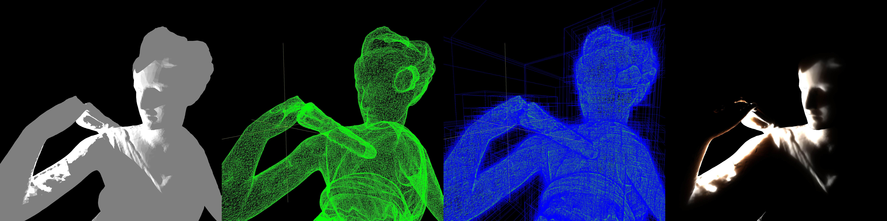

# DH2323-project



This repository contains the final project for the course **DH2323 Computer Graphics and Interaction** at KTH Royal Institute of Technology.

**Authors:**
- Maximilian Benedicto
- Arman Montazeri

## Overview

A custom software rendering engine built in C++. The project implements various rendering techniques including:
- **Subsurface Scattering**: Utilizing the Dipole model for realistic rendering of translucent materials.
- **Acceleration Structures**: Bounding Volume Hierarchies (BVH) for efficient ray-scene intersection.
- **Model Loading**: Support for `.obj` and `.ply` mesh configurations.
- **Materials and Shading**: Lambertian shading, wireframe rendering, and textured materials.

## Dependencies

The project uses CMake to fetch and build the following dependencies automatically:
- [GLM](https://github.com/g-truc/glm) - Mathematics library for graphics
- [SDL3](https://github.com/libsdl-org/SDL) - Windowing and input handling
- [stb_image](https://github.com/nothings/stb) - Image loading
- [tinyobjloader](https://github.com/tinyobjloader/tinyobjloader) - OBJ model loading
- [happly](https://github.com/nmwsharp/happly) - PLY model loading

## Build Instructions

Ensure you have a recent version of CMake and a C++ compiler installed on your system.

```bash
# Clone the repository
git clone <repo-url>
cd DH2323-project

# Configure and build using CMake
mkdir build
cd build
cmake ..
make -j4
```

## Running

After building successfully, run the executable from the `build` directory:
```bash
./DH2323Project
```

## Controls

The application features an interactive camera, movable light source, and on-the-fly shader/model switching. 

### Camera Controls
- **W / S**: Move Forward / Backward
- **A / D**: Move Left / Right
- **Space / LShift**: Move Down / Up
- **Up / Down Arrows**: Pitch Up / Down
- **Left / Right Arrows**: Yaw Left / Right
- **Q / E**: Roll Left / Right
- **Backspace**: Reset Camera Position

### Light Controls
- **J / L**: Move Light -X / +X
- **U / O**: Move Light +Y / -Y
- **I / K**: Move Light +Z / -Z

### Application Controls
- **1**: Switch Shader (cycles through Wireframe, Dipole Scattering modes, and Lambertian)
- **2**: Switch Model
- **+ / -**: Increase / Decrease Render Resolution
- **Left Alt**: Save Screenshot (saved as `screenshot_<timestamp>.bmp`)